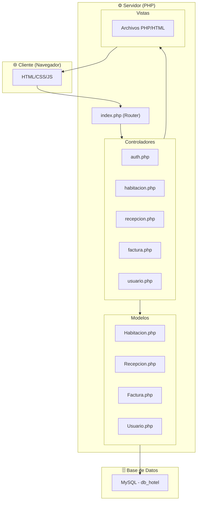

# Vista General de la Arquitectura

Sistema Hotel utiliza el patrón arquitectónico **MVC (Modelo-Vista-Controlador)** para separar las responsabilidades del código.

## Diagrama de Arquitectura



## Flujo de una Petición

1. **Usuario** hace una petición desde el navegador
2. **index.php** recibe la petición y determina qué controlador invocar
3. **Controlador** procesa la lógica de negocio
4. **Modelo** interactúa con la base de datos
5. **Vista** renderiza el HTML con los datos
6. **Respuesta** se envía al navegador

## Estructura de Carpetas

```plaintext
SistemaHotel-PHP/
├── config/              # Configuración
│   ├── database.php     # Conexión a BD
│   └── session.php      # Gestión de sesiones
│
├── controller/          # Controladores (17 archivos)
│   ├── auth.php         # Autenticación
│   ├── habitacion.php   # CRUD habitaciones
│   ├── recepcion.php    # Check-in/out
│   └── ...
│
├── models/              # Modelos (16 archivos)
│   ├── Habitacion.php   # Modelo de habitaciones
│   ├── Recepcion.php    # Modelo de recepciones
│   └── ...
│
├── view/                # Vistas (26 carpetas)
│   ├── Habitaciones/    # Vistas de habitaciones
│   ├── MntRecepcion/    # Mantenimiento recepción
│   └── ...
│
├── assets/              # Recursos estáticos
│   ├── css/
│   ├── js/
│   └── images/
│
└── tests/               # Pruebas
    ├── php/             # PHPUnit
    └── js/              # Jest
```

## Controladores Disponibles

| Controlador | Función |
|-------------|---------|
| `auth.php` | Login/logout, sesiones |
| `habitacion.php` | CRUD de habitaciones |
| `recepcion.php` | Check-in/Check-out |
| `factura.php` | Generación de facturas |
| `boleta.php` | Generación de boletas |
| `cliente.php` | Gestión de clientes |
| `usuario.php` | Administración de usuarios |
| `rol.php` | Roles y permisos |
| `producto.php` | Inventario de productos |
| `venta.php` | Ventas de productos |
| `reporte.php` | Reportes y estadísticas |
| `tarifa.php` | Tarifas de habitaciones |
| `categoria.php` | Categorías de habitaciones |
| `piso.php` | Pisos del hotel |
| `estadohabitacion.php` | Estados de habitación |
