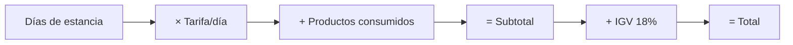

# Facturación

El módulo de facturación permite generar boletas y facturas para los servicios del hotel.

## Componentes

### Controladores
- `controller/factura.php` - Gestión de facturas
- `controller/boleta.php` - Gestión de boletas
- `controller/comprobante.php` - Lógica común de comprobantes

### Modelos
- `models/Factura.php`
- `models/Boleta.php`

## Tipos de Comprobante

| Tipo | Uso | Requisitos Cliente |
|------|-----|-------------------|
| **Boleta** | Persona natural | DNI |
| **Factura** | Empresa | RUC, Razón Social |

## Generar Factura

```php
// controller/factura.php
public function generar($recepcion_id, $datos_fiscales) {
    $recepcion = Recepcion::find($recepcion_id);
    
    $factura = new Factura();
    $factura->recepcion_id = $recepcion_id;
    $factura->ruc = $datos_fiscales['ruc'];
    $factura->razon_social = $datos_fiscales['razon_social'];
    $factura->subtotal = $this->calcularSubtotal($recepcion);
    $factura->igv = $factura->subtotal * 0.18;
    $factura->total = $factura->subtotal + $factura->igv;
    $factura->fecha = date('Y-m-d');
    
    return $factura->save();
}
```

## Cálculo de Montos



## Conceptos Facturables

- Hospedaje (días × tarifa)
- Productos del minibar
- Servicios adicionales (lavandería, room service)
- Penalidades (late check-out, daños)

## Exportar a PDF

El sistema genera PDFs listos para imprimir:

```php
// Ubicación de plantillas PDF
view/pdf/factura.php
view/pdf/boleta.php
```

## Vistas Relacionadas

- `view/HistorialComprobantes/` - Lista de facturas/boletas
- `view/pdf/` - Plantillas de impresión
