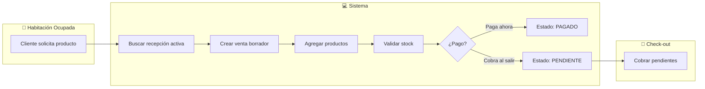
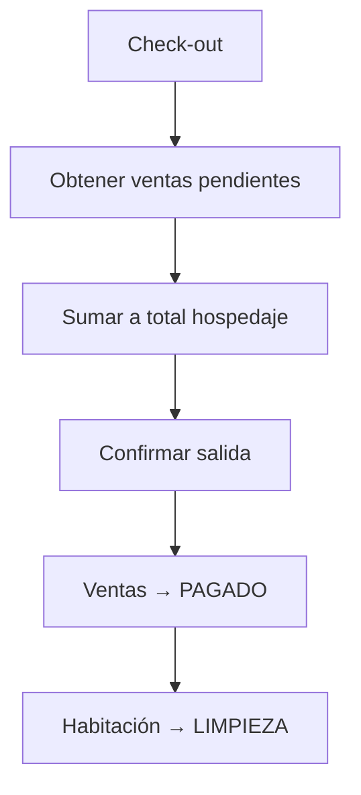

# Productos y Ventas

El sistema permite registrar ventas de productos (room service, minibar, consumibles) asociadas a una recepción activa. Los consumos se pueden cobrar al momento o dejarse pendientes para el check-out.

## Flujo de Room Service



---

## 📦 Gestión de Productos

### Crear Producto

**Endpoint:** `controller/producto.php?op=guardaryeditar`

| Campo | Tipo | Descripción |
|-------|------|-------------|
| `pro_nom` | string | Nombre del producto (único) |
| `pro_det` | string | Descripción/detalle |
| `pro_pre` | float | Precio de venta |
| `pro_cant` | int | Stock disponible |

**Ejemplo:**

```javascript
$.post('controller/producto.php?op=guardaryeditar', {
    pro_nom: 'Agua Mineral 500ml',
    pro_det: 'Agua embotellada sin gas',
    pro_pre: 5.00,
    pro_cant: 100
});
```

### Listar Productos

**Endpoint:** `controller/producto.php?op=listar`

Retorna productos con:
- Nombre, descripción, precio
- Stock actual
- Estado (Activo/Inactivo)

### Control de Stock

El sistema valida automáticamente el stock disponible antes de agregar productos a una venta:

```javascript
// Si stock insuficiente, retorna error:
{"success": false, "message": "Stock insuficiente. Disponible: 5"}
```

---

## 🛒 Registro de Ventas

### Estados de una Venta

| Estado | Descripción | Stock |
|--------|-------------|-------|
| `BORRADOR` | Venta en proceso, aún no confirmada | Sin descontar |
| `PENDIENTE` | Confirmada, se cobra al check-out | Descontado |
| `PAGADO` | Pagada completamente | Descontado |

### Crear Venta para Habitación

**Endpoint:** `controller/venta.php?op=registrar`

```javascript
$.post('controller/venta.php?op=registrar', {
    rec_id: 45  // ID de la recepción activa
});
```

**Respuesta:**
```json
{"success": true, "VENT_ID": 12}
```

:::tip Nota
Si no se envía `rec_id`, el sistema busca la recepción activa desde la sesión o por la habitación asociada.
:::

### Agregar Producto a la Venta

**Endpoint:** `controller/venta.php?op=guardardetalle`

```javascript
$.post('controller/venta.php?op=guardardetalle', {
    vent_id: 12,      // ID de la venta
    prod_id: 3,       // ID del producto
    prod_pventa: 5.00, // Precio unitario
    detv_cant: 2       // Cantidad
});
```

**Validaciones automáticas:**
- ✅ Producto existe y tiene stock configurado
- ✅ Stock disponible > 0
- ✅ Cantidad solicitada ≤ Stock disponible

### Ver Productos en la Venta

**Endpoint:** `controller/venta.php?op=listardetalle`

```javascript
$.post('controller/venta.php?op=listardetalle', {
    vent_id: 12
});
```

### Eliminar Producto de la Venta

**Endpoint:** `controller/venta.php?op=eliminardetalle`

```javascript
$.post('controller/venta.php?op=eliminardetalle', {
    detv_id: 8  // ID del detalle
});
```

---

## 💰 Calcular Totales

**Endpoint:** `controller/venta.php?op=calculo`

```javascript
$.post('controller/venta.php?op=calculo', {
    vent_id: 12
});
```

**Respuesta:**
```json
{
    "VENT_SUBTOTAL": "10.00",
    "VENT_IGV": "1.80",
    "VENT_TOTAL": "11.80"
}
```

---

## 💳 Confirmar Venta

**Endpoint:** `controller/venta.php?op=guardar`

### Opción 1: Pago Inmediato

```javascript
$.post('controller/venta.php?op=guardar', {
    vent_id: 12,
    vent_estado: 'PAGADO'
});
```

El sistema:
1. Recalcula totales
2. Descuenta stock de productos
3. Marca venta como PAGADO

### Opción 2: Cobrar al Check-out

```javascript
$.post('controller/venta.php?op=guardar', {
    vent_id: 12,
    vent_estado: 'PENDIENTE'
});
```

El sistema:
1. Recalcula totales
2. Mantiene la venta pendiente
3. Se cobrará al confirmar salida

---

## ❌ Cancelar Venta

**Endpoint:** `controller/venta.php?op=cancelar_borrador`

```javascript
$.post('controller/venta.php?op=cancelar_borrador', {
    vent_id: 12
});
```

Solo funciona si la venta está en estado `BORRADOR`. Restaura el stock de los productos.

---

## Ver Ventas de una Recepción

**Endpoint:** `controller/venta.php?op=listar_por_recepcion`

```javascript
$.post('controller/venta.php?op=listar_por_recepcion', {
    rec_id: 45
});
```

Útil para mostrar todos los consumos de un huésped antes del check-out.

---

## Integración con Check-out

Al confirmar salida en recepción:
1. Se listan todas las ventas PENDIENTES
2. Se suman al total a cobrar
3. Al confirmar, las ventas pasan a PAGADO



---

## Vistas Relacionadas

| Vista | Ruta | Descripción |
|-------|------|-------------|
| Productos | `view/MntProducto/list.php` | CRUD de productos |
| Panel productos | `view/Productos/index.php` | Vista para empleados |
| Registrar venta | `view/MntVender/form.php` | Agregar productos |
| Lista ventas | `view/ListVender/list.php` | Historial de ventas |
