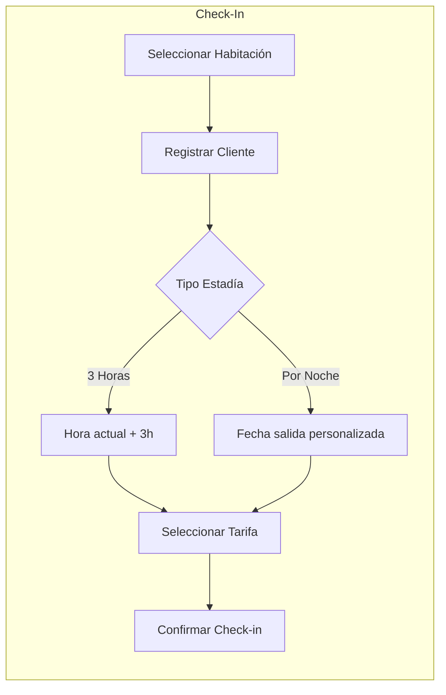
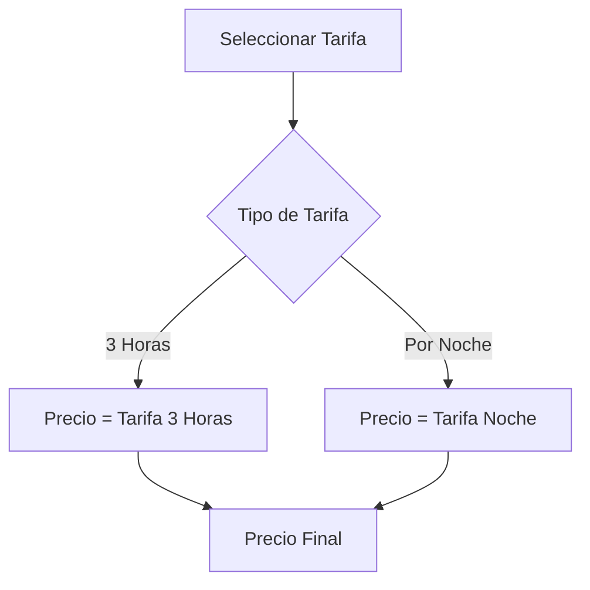

# Recepción

El módulo de recepción gestiona el proceso de check-in y check-out de huéspedes, soportando dos modalidades de estadía.

## Tipos de Recepción

El sistema maneja **dos tipos de estadía**:

| Tipo | Duración | Cálculo de Precio |
|------|----------|-------------------|
| ⏰ **Por 3 Horas** | 3 horas (default) | Prorrateo: `(precio_noche / 24) × 3` |
| 🌙 **Por Noche** | Fecha personalizada | Precio de tarifa asignada |



---

## Componentes

### Controladores
- `controller/recepcion.php` - Lógica principal de check-in/out
- `controller/cliente.php` - Gestión de datos del huésped

### Modelos
- `models/Recepcion.php` - Operaciones de base de datos
- `models/Cliente.php` - Datos de clientes

---

## Registrar Check-in (3 Horas)

**Endpoint:** `controller/recepcion.php?op=guardaryeditar`

Cuando **no se especifica fecha de salida**, el sistema automáticamente asigna 3 horas desde la hora actual.

**Campos:**

| Campo | Tipo | Requerido | Descripción |
|-------|------|-----------|-------------|
| `cli_id` | int | ✅ | ID del cliente |
| `hab_id` | int | ✅ | ID de la habitación |
| `tar_id` | int | ❌ | ID de la tarifa (null = usar prorrateo) |
| `precio_inicial` | float | ❌ | Precio total a cobrar |
| `adelanto` | float | ❌ | Monto adelantado |
| `observacion` | string | ❌ | Notas adicionales |
| `tipo_comprobante` | string | ❌ | '03' = Boleta, '01' = Factura |

**Ejemplo - Estadía de 3 horas:**

```javascript
$.post('controller/recepcion.php?op=guardaryeditar', {
    cli_id: 15,
    hab_id: 5,
    tar_id: 2,           // Tarifa "3 Horas"
    precio_inicial: 50.00,
    adelanto: 50.00,     // Pago completo adelantado
    tipo_comprobante: '03'  // Boleta
    // No se envía fecha_salida → 3 horas automáticamente
});
```

---

## Registrar Check-in (Por Noche)

Para estadías por noche, **se envía la fecha de salida explícitamente**.

**Ejemplo - Estadía por noche:**

```javascript
$.post('controller/recepcion.php?op=guardaryeditar', {
    cli_id: 15,
    hab_id: 5,
    tar_id: 3,           // Tarifa "Por Noche"
    precio_inicial: 150.00,
    adelanto: 50.00,     // Adelanto parcial
    fecha_salida: '2024-12-08 12:00',  // Check-out mañana a mediodía
    tipo_comprobante: '01'  // Factura
});
```

---

## Cálculo de Precios

El precio se obtiene directamente de la **tarifa seleccionada**, no se calcula:



### Tarifas Disponibles

| Tarifa | Descripción | Ejemplo Precio |
|--------|-------------|----------------|
| **3 Horas** | Estadía corta | S/. 50.00 |
| **Por Noche** | Estadía completa | S/. 120.00 |

:::tip Importante
El precio **no se calcula automáticamente**. El sistema usa el precio configurado en la tarifa seleccionada por el usuario al momento del check-in.
:::

---

## Listar Ocupaciones Activas

**Endpoint:** `controller/recepcion.php?op=listar_ocupaciones_activas`

Retorna todas las habitaciones actualmente ocupadas:

```json
[
  {
    "REC_ID": 45,
    "HAB_ID": 5,
    "CLI_ID": 15,
    "FECHA_SALIDA": "2024-12-07 18:00:00",
    "CLI_NOMBRE": "Juan Pérez",
    "CLI_NOM": "Juan",
    "CLI_APE": "Pérez"
  }
]
```

---

## Obtener Detalle de Recepción

**Endpoint:** `controller/recepcion.php?op=obtener_x_id`

```javascript
$.post('controller/recepcion.php?op=obtener_x_id', {
    rec_id: 45
});
```

**Respuesta:**

```json
{
  "success": true,
  "data": {
    "IdRecepcion": 45,
    "IdCliente": 15,
    "IdHabitacion": 5,
    "IdTarifa": 2,
    "HAB_NUM": "101",
    "TARIFA_DESC": "3 Horas",
    "FechaEntrada": "2024-12-07 12:00:00",
    "FechaSalida": "2024-12-07 15:00:00",
    "PrecioInicial": 50.00,
    "Adelanto": 50.00,
    "PrecioRestante": 0.00,
    "TipoComprobante": "03",
    "Estado": 1
  }
}
```

---

## Confirmar Salida (Check-out)

**Endpoint:** `controller/recepcion.php?op=confirmar_salida`

```javascript
$.post('controller/recepcion.php?op=confirmar_salida', {
    rec_id: 45,
    costo_penalidad: 0.00,      // Penalidad por horas extra
    total_pagado: 50.00,
    fecha_confirmacion: '2024-12-07 15:05:00'
});
```

### Proceso de Check-out

Al confirmar salida, el sistema:

1. ✅ Actualiza `FechaSalidaConfirmacion`
2. ✅ Registra `TotalPagado` y `CostoPenalidad`
3. ✅ Cambia estado de recepción a `0` (inactiva)
4. ✅ Cambia ventas pendientes a `PAGADO`
5. ✅ Cambia habitación a estado `LIMPIEZA`

---

## Penalidades

Si el huésped excede el tiempo de estadía:

| Situación | Acción |
|-----------|--------|
| Salida a tiempo | Sin penalidad |
| Salida tardía | Calcular horas extra × tarifa hora |
| Daños a habitación | Agregar costo adicional |

```javascript
// Ejemplo con penalidad por 2 horas extra
$.post('controller/recepcion.php?op=confirmar_salida', {
    rec_id: 45,
    costo_penalidad: 20.00,  // 2 horas × S/.10/hora
    total_pagado: 70.00      // precio_inicial + penalidad
});
```

---

## Validaciones del Sistema

| Validación | Mensaje de Error |
|------------|------------------|
| Cliente sin seleccionar | "Cliente y Habitación son obligatorios" |
| Habitación sin seleccionar | "Cliente y Habitación son obligatorios" |
| Cliente con recepción activa | "El cliente ya tiene una recepción activa" |
| Tipo comprobante inválido | Se usa '03' (Boleta) por defecto |

---

## Vistas Relacionadas

| Vista | Ruta | Descripción |
|-------|------|-------------|
| Panel habitaciones | `view/Habitaciones/index.php` | Vista de recepción con estados |
| Check-in | `view/MntRecepcion/form.php` | Formulario de registro |
| Lista activas | `view/ListRecepcion/list.php` | Recepciones activas |
| Check-out | `view/DetalleSalida/form.php` | Proceso de salida |
| Detalle | `view/DetalleRecepcion/detail.php` | Información completa |
