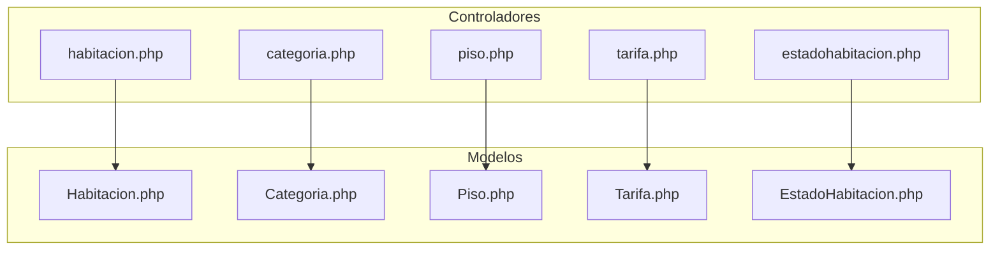

# Gestión de Habitaciones

El módulo de habitaciones es el núcleo del sistema, permitiendo administrar todas las habitaciones del hotel junto con sus categorías, pisos, estados y tarifas.

## Arquitectura del Módulo



---

## 🏨 Habitaciones

### Crear Habitación

**Endpoint:** `controller/habitacion.php?op=guardaryeditar`

**Campos requeridos:**

| Campo | Tipo | Descripción |
|-------|------|-------------|
| `hab_num` | string | Número de habitación (único) |
| `hab_det` | string | Descripción de la habitación |
| `hab_piso_id` | int | ID del piso |
| `hab_cat_id` | int | ID de la categoría |
| `hab_est_id` | int | ID del estado (opcional, default: Disponible) |

**Ejemplo de uso:**

```php
// Crear nueva habitación
$data = [
    'hab_num' => '101',
    'hab_det' => 'Habitación con vista al jardín',
    'hab_piso_id' => 1,
    'hab_cat_id' => 2  // Doble
];

// POST a controller/habitacion.php?op=guardaryeditar
```

**Validaciones:**
- ✅ Número de habitación no puede estar vacío
- ✅ Descripción es obligatoria
- ✅ Debe seleccionar piso y categoría
- ✅ No puede existir otra habitación con el mismo número

### Listar Habitaciones

**Endpoint:** `controller/habitacion.php?op=listar`

Retorna todas las habitaciones en formato DataTables:

```json
{
  "aaData": [
    ["101", "Vista jardín", "<button>Tarifas</button>", "Piso 1", "Doble", "Activo", ...],
    ...
  ]
}
```

### Editar Habitación

**Endpoint:** `controller/habitacion.php?op=mostrar` (GET) + `guardaryeditar` (POST)

```javascript
// 1. Obtener datos actuales
$.post('controller/habitacion.php?op=mostrar', {hab_id: 5}, function(data) {
    // Llenar formulario con data
});

// 2. Guardar cambios (incluir hab_id para actualizar)
$.post('controller/habitacion.php?op=guardaryeditar', {
    hab_id: 5,  // ID existente = actualizar
    hab_num: '101A',
    hab_det: 'Nueva descripción',
    hab_piso_id: 1,
    hab_cat_id: 2
});
```

### Cambiar Estado

**Endpoint:** `controller/habitacion.php?op=cambiar_estado`

```javascript
// Activar/desactivar habitación
$.post('controller/habitacion.php?op=cambiar_estado', {
    hab_id: 5,
    estado: 'true'  // o 'false'
});
```

### Cambiar Estado de Ocupación

**Endpoint:** `controller/habitacion.php?op=cambiar_tipo_estado`

Estados disponibles:
- 🟢 **DISPONIBLE** - Lista para reservar
- 🔴 **OCUPADA** - Cliente hospedado
- 🟡 **LIMPIEZA** - En proceso de limpieza
- 🟠 **MANTENIMIENTO** - Requiere reparación

```javascript
$.post('controller/habitacion.php?op=cambiar_tipo_estado', {
    hab_id: 5,
    id_estado_habitacion: 2  // OCUPADA
});
```

### Eliminar Habitación

**Endpoint:** `controller/habitacion.php?op=eliminar`

```javascript
$.post('controller/habitacion.php?op=eliminar', {hab_id: 5});
```

:::warning Atención
La eliminación es **física** (elimina el registro de la base de datos). Para desactivar temporalmente una habitación sin eliminarla, usa "Cambiar Estado" en su lugar.
:::

---

## 📁 Categorías

Las categorías definen los tipos de habitación disponibles.

### Crear Categoría

**Endpoint:** `controller/categoria.php?op=guardaryeditar`

```javascript
$.post('controller/categoria.php?op=guardaryeditar', {
    cat_nom: 'Suite Presidencial'
});
```

### Listar Categorías

**Endpoint:** `controller/categoria.php?op=listar`

### Combo de Categorías

**Endpoint:** `controller/categoria.php?op=combo`

Retorna HTML listo para usar en un `<select>`:

```html
<option selected>Seleccionar</option>
<option value='1'>Simple</option>
<option value='2'>Doble</option>
<option value='3'>Matrimonial</option>
<option value='4'>Suite</option>
```

---

## 🏢 Pisos

Gestiona la distribución física del hotel por pisos.

### Crear Piso

**Endpoint:** `controller/piso.php?op=guardaryeditar`

```javascript
$.post('controller/piso.php?op=guardaryeditar', {
    piso_nom: 'Piso 5 - Ejecutivo'
});
```

### Listar Pisos Activos

**Endpoint:** `controller/piso.php?op=listar_activos`

```json
[
  {"PISO_ID": 1, "PISO_NOM": "Piso 1"},
  {"PISO_ID": 2, "PISO_NOM": "Piso 2"}
]
```

### Filtrar Habitaciones por Piso

**Endpoint:** `controller/habitacion.php?op=filtrar_por_piso`

```javascript
$.post('controller/habitacion.php?op=filtrar_por_piso', {
    piso_id: 2
});
```

---

## 💰 Tarifas

Sistema flexible de precios por habitación con vigencia temporal.

### Crear Tarifa

**Endpoint:** `controller/tarifa.php?op=guardaryeditar`

```javascript
$.post('controller/tarifa.php?op=guardaryeditar', {
    tar_desc: 'Temporada Alta',
    tar_precio: 250.00
});
```

### Asignar Tarifa a Habitación

**Endpoint:** `controller/habitacion.php?op=asignar_tarifa`

```javascript
$.post('controller/habitacion.php?op=asignar_tarifa', {
    hab_id: 5,
    tarifa_id: 3,
    fecha_inicio: '2024-12-01',
    fecha_fin: '2024-12-31'  // Opcional
});
```

### Ver Tarifas Asignadas

**Endpoint:** `controller/habitacion.php?op=listar_tarifas_asignadas`

```javascript
$.post('controller/habitacion.php?op=listar_tarifas_asignadas', {
    hab_id: 5
});
```

### Actualizar Vigencia

**Endpoint:** `controller/habitacion.php?op=actualizar_vigencia_tarifa`

```javascript
$.post('controller/habitacion.php?op=actualizar_vigencia_tarifa', {
    habitacion_tarifa_id: 10,
    fecha_inicio: '2024-12-15',
    fecha_fin: '2025-01-15'
});
```

### Eliminar Tarifa Asignada

**Endpoint:** `controller/habitacion.php?op=eliminar_tarifa_asignada`

```javascript
$.post('controller/habitacion.php?op=eliminar_tarifa_asignada', {
    habitacion_tarifa_id: 10
});
```

---

## 🔄 Estados de Habitación

### Estados Disponibles

| ID | Estado | Uso |
|----|--------|-----|
| 1 | DISPONIBLE | Puede ser reservada |
| 2 | OCUPADA | Cliente hospedado actualmente |
| 3 | LIMPIEZA | Personal de limpieza trabajando |
| 4 | MANTENIMIENTO | Requiere reparaciones |

### Combo de Estados

**Endpoint:** `controller/habitacion.php?op=combo_estado_habitacion`

---

## Vistas del Módulo

| Vista | Ruta | Descripción |
|-------|------|-------------|
| Lista de habitaciones | `view/MntHabitacion/list.php` | CRUD completo |
| Formulario habitación | `view/MntHabitacion/form.php` | Alta/edición |
| Panel visual | `view/Habitaciones/index.php` | Vista de recepción |
| Categorías | `view/MntCategoria/list.php` | Gestión de categorías |
| Pisos | `view/MntPiso/list.php` | Gestión de pisos |
| Tarifas | `view/MntTarifa/list.php` | Gestión de tarifas |
