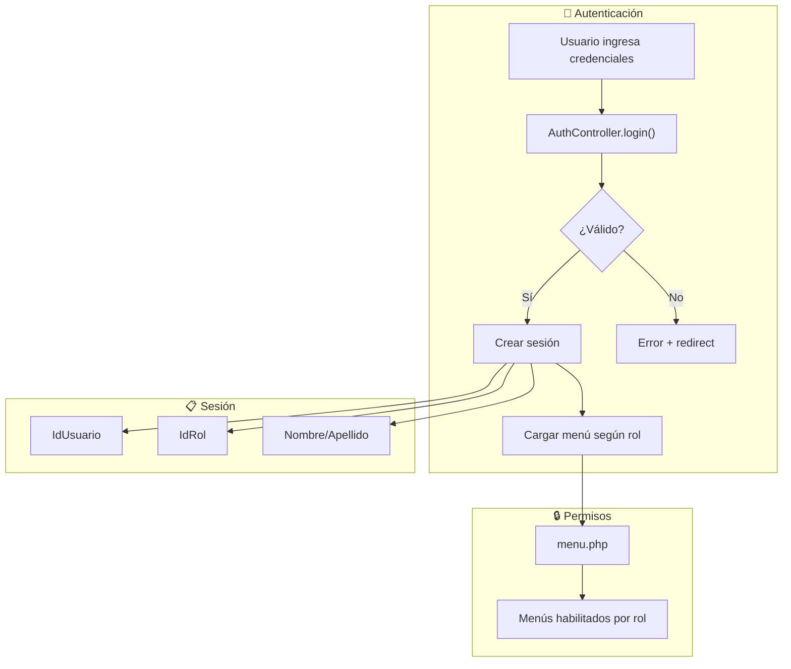
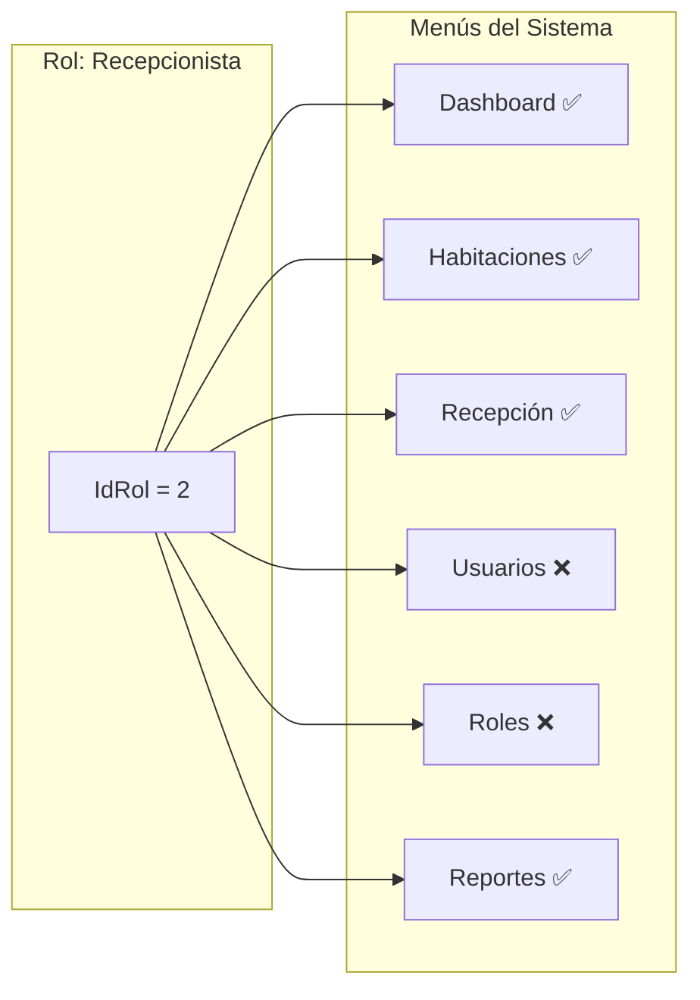

# Usuarios, Roles y Permisos

El sistema implementa un control de acceso basado en roles (RBAC) que permite definir qué funcionalidades puede acceder cada tipo de usuario.

## Arquitectura de Seguridad



---

## 🔐 Autenticación

### Login

**Archivo:** `controller/auth.php`

**Flujo de autenticación:**

1. Usuario envía correo y contraseña
2. Se valida formato del email
3. Se busca usuario en BD
4. Se verifica contraseña hasheada
5. Se crea sesión con datos del usuario

**Variables de sesión creadas:**

| Variable | Descripción |
|----------|-------------|
| `$_SESSION["IdUsuario"]` | ID único del usuario |
| `$_SESSION["Nombre"]` | Nombre del usuario |
| `$_SESSION["Apellido"]` | Apellido del usuario |
| `$_SESSION["IdRol"]` | ID del rol asignado |
| `$_SESSION["Correo"]` | Email del usuario |

**Códigos de error:**

| Código | Significado |
|--------|-------------|
| 1 | Credenciales incorrectas |
| 2 | Campos vacíos |
| 3 | Email vacío |
| 4 | Contraseña vacía |
| 5 | Email con formato inválido |

### Logout

```php
// AuthController->logout()
SessionManager::destroy();
header("Location: index.php");
```

---

## 👥 Gestión de Usuarios

### Crear Usuario

**Endpoint:** `controller/usuario.php?op=guardaryeditar`

**Campos requeridos:**

| Campo | Tipo | Validación |
|-------|------|------------|
| `usu_nom` | string | Nombre del usuario |
| `usu_ape` | string | Apellido del usuario |
| `usu_dni` | string | DNI único (se valida duplicado) |
| `usu_correo` | string | Email único (se valida duplicado) |
| `usu_pass` | string | Contraseña (se hashea automáticamente) |
| `rol_id` | int | ID del rol asignado |

**Ejemplo:**

```javascript
$.post('controller/usuario.php?op=guardaryeditar', {
    usu_nom: 'Juan',
    usu_ape: 'Pérez',
    usu_dni: '12345678',
    usu_correo: 'juan@hotel.com',
    usu_pass: 'password123',
    rol_id: 2  // Recepcionista
});
```

### Validaciones

El sistema valida automáticamente:

- ✅ **Email único** - No puede repetirse entre usuarios
- ✅ **DNI único** - No puede repetirse entre usuarios
- ✅ **Contraseña hasheada** - Se encripta antes de guardar

### Listar Usuarios

**Endpoint:** `controller/usuario.php?op=listar`

:::tip Nota
El listado excluye al usuario actual para evitar que se auto-elimine o desactive.
:::

### Cambiar Contraseña

**Endpoint:** `controller/usuario.php?op=actualizar_password`

```javascript
$.post('controller/usuario.php?op=actualizar_password', {
    usu_id: 5,
    usu_pass: 'nueva_password'
});
```

---

## 🎭 Gestión de Roles

### Crear Rol

**Endpoint:** `controller/rol.php?op=guardaryeditar`

```javascript
$.post('controller/rol.php?op=guardaryeditar', {
    rol_nom: 'Supervisor'
});
```

**Validaciones:**
- Nombre obligatorio
- Máximo 50 caracteres
- Nombre único (no puede repetirse)

### Roles Típicos del Sistema

| Rol | Acceso |
|-----|--------|
| **Administrador** | Acceso completo a todo el sistema |
| **Recepcionista** | Check-in/out, habitaciones, clientes |
| **Empleado** | Vista limitada de habitaciones y ventas |

### Listar Roles

**Endpoint:** `controller/rol.php?op=listar`

Cada rol muestra:
- Nombre del rol
- Estado (Activo/Inactivo)
- Botón de permisos
- Botón de editar/eliminar

---

## 🔒 Sistema de Permisos

El sistema de permisos permite habilitar o deshabilitar módulos del menú para cada rol.

### Estructura de Permisos

**Archivo:** `controller/menu.php`

Cada rol tiene asociados **permisos por menú**:



### Ver Permisos de un Rol

**Endpoint:** `controller/menu.php?op=listar`

```javascript
$.post('controller/menu.php?op=listar', {
    rol_id: 2  // Recepcionista
});
```

**Respuesta:**
```json
{
  "aaData": [
    ["Dashboard", "<button class='btn-success'>Sí</button>"],
    ["Usuarios", "<button class='btn-danger'>No</button>"]
  ]
}
```

### Habilitar Permiso

**Endpoint:** `controller/menu.php?op=habilitar`

```javascript
$.post('controller/menu.php?op=habilitar', {
    mend_id: 15  // ID del menú-detalle
});
```

### Deshabilitar Permiso

**Endpoint:** `controller/menu.php?op=deshabilitar`

```javascript
$.post('controller/menu.php?op=deshabilitar', {
    mend_id: 15
});
```

### Inicializar Permisos para Nuevo Rol

Cuando se crea un nuevo rol, se deben inicializar sus permisos:

**Endpoint:** `controller/menu.php?op=insert`

```javascript
$.post('controller/menu.php?op=insert', {
    rol_id: 5  // Nuevo rol creado
});
```

Esto crea registros en la tabla de detalle de menú para cada opción del sistema.

---

## Vistas Relacionadas

| Vista | Ruta | Descripción |
|-------|------|-------------|
| Login | `index.php` | Formulario de inicio de sesión |
| Lista usuarios | `view/MntUsuario/list.php` | CRUD de usuarios |
| Lista roles | `view/MntRol/list.php` | CRUD de roles |
| Permisos | Modal en `MntRol` | Configurar permisos por rol |

---

## Middleware de Seguridad

El sistema incluye un middleware que verifica la autenticación:

```php
// middleware/SessionMiddleware.php
SessionMiddleware::checkAuthentication();
```

Este middleware:
- Verifica si existe sesión activa
- Renueva el tiempo de sesión
- Redirige a login si no hay sesión
